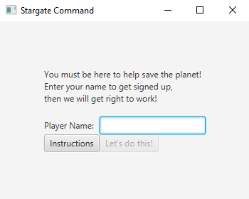
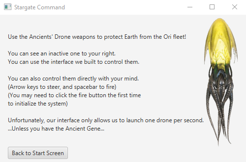
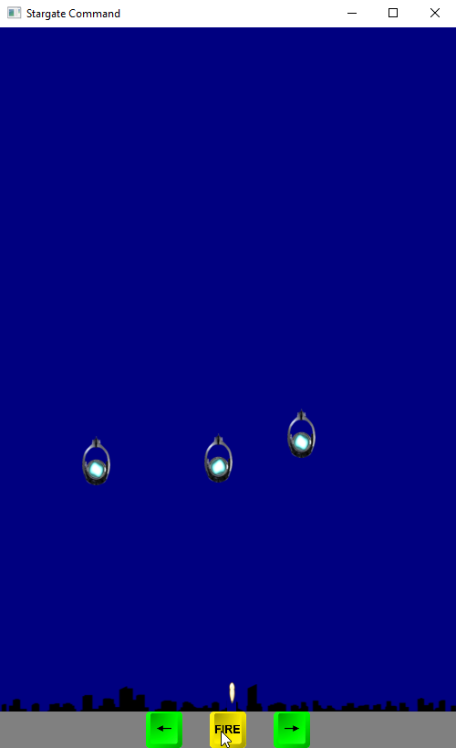
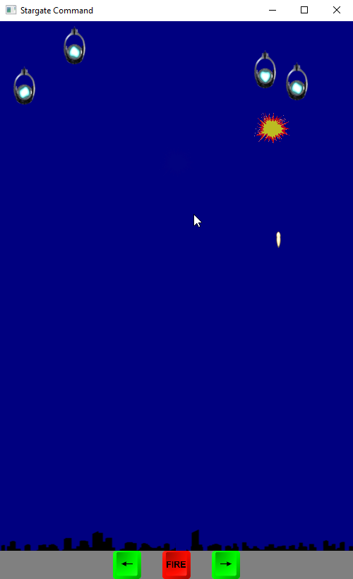
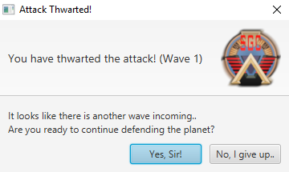
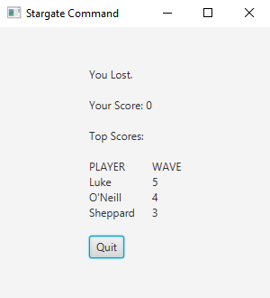

# InvasionGame
An invasion game we made in our first year of classes.
It is written in Java and uses JavaFX. 
Similar to space invaders, but style taken from Stargate SG-1, as well as the ships move independently.

# Screenshots

